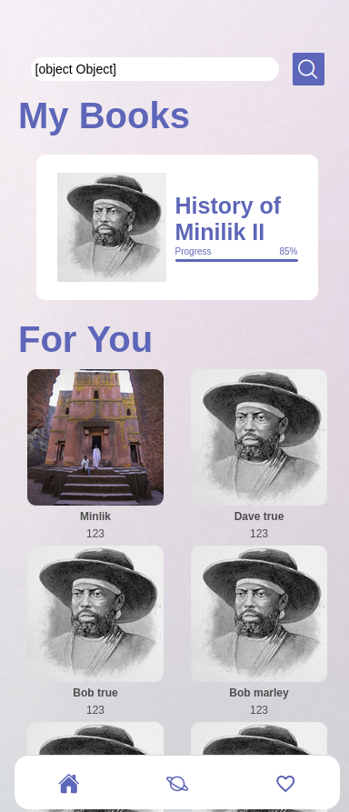

# Ethiopian-history 📚 (under development 🚧) 

This project was made via React Native, its main purpose is read about ethipian history (very desciptive 😅)

## Running the project 

You must have node js installed on your system

```bash
# install all dependency  
npm install 
# Run the project in development 
npm run start
```
# Screenshots

